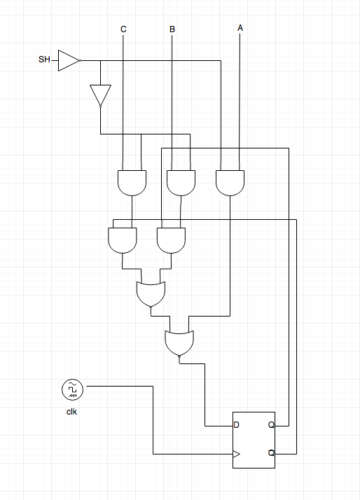

# Verilog General Guide

This document aims to provide general guide to writing Verilog HDL. _Basic_ section focus on grammar with common fallacies and pitfalls, while _Advance_ section focus on style and common patterns.

## Basic

### What Verilog is and is not?

We (students) use Verilog HDL to program FPGA. But it is necessary to know that Verilog is used in many other ways. Some tips are:

- It is hardware **Description** Language (HDL). So you'd better know what hardware module (deep into circuit) you want to build before writing Verilog code.
- It aims to replace schematic hardware description.
- It is heavily used on simulation and behavior verification.
- It is **NOT** C programming language. Do not think of software development when you are writing Verilog.
- It is **NOT** completely synthesizable (only part of it).

### Verilog grammar quick walk through

Attention: This chapter only contains Verilog grammar that is frequently used. Most "advanced grammar" is omitted.

Pay great attention to those **bold words**. It indicates place where mistakes usually happen.

#### Module

A module is like a class in object oriented language. A simple module descripting a counter is like:

```verilog
module counter(
    input clk,
    input reset,
    output [31:0] cnt
);

    reg [31:0] cnt_reg;

    always @(posedge clk) begin
        if (reset) begin
            cnt_reg <= 32'b0;
        end else begin
            cnt_reg <= cnt_reg + 1'b1;
        end
    end

    assign cnt = cnt_reg;

endmodule
```

The type of a module port can be `input`, `output` or `inout` (rarely used, but couldn't be avoided in some cases).

Using a module is like instantiate a class:

```verilog
module top(
    input clk,
    input reset
);
    wire [31:0] cnt;

    counter counter(
        .clk(clk),
        .reset(reset),
        .cnt(cnt)
    );

endmodule
```

#### Variable
    
`wire` and `reg` are two types that most commonly used.

- `wire`: Physically a wire. Can not "hold" value. Must be continuously assigned.
- `reg`: **Not necessarily** a register. Can "hold" value. Can be conditionaly assigned.

#### Assignment

`assign` keyword is used when assigning a wire (outside of always block). The value is continuous assigned to the wire. It makes sense because a physical wire always has a value (either high or low).

`=` (block assignment) and `<=` (non-block assignment) operators are used when assign a reg.

- block assignment:
    - evaluated and assgined in a single step.
    - execution flow within the procedure is blocked until the assignment is blocked.
    - usually used in combinational always block (Xilinx suggests never use block assignment in sequential logic even you can use them technically and the code sucessfully synthesizes)

Block assignment example:

```verilog
module foo_logic(
    input clk,
    input a,
    input b,
    input c,
    input sh
);
    reg data;

    // Though this varables is "reg" type, it is physically a wire.
    // We type it as "reg" so that we can use it in an always block with "if" and "else" condition
    reg data_in;

    always @* begin
        // provide default value
        data_in = 1'b0;
        if (a & ~sh) begin
            data_in = 1'b1;
        end else begin
            if (~data & (c & sh))
                data_in = 1'b1;
            else if (data & (b & sh))
                data_in = 1'b1;
        end
    end

    always @(posedge clk) begin
        data <= data_in;
    end

endmodule
```

The diagram is:



The module can be writen without combinational always block as:

```verilog
module foo_logic(
    input clk,
    input a,
    input b,
    input c,
    input sh
);
    // This is the only real register
    reg data;

    wire q = data;
    wire notq = ~data;

    wire anda;
    wire andb;
    wire andc;
    wire andq;
    wire andqbar;
    wire orq;
    wire data_in;

    assign andc = c & sh;
    assign andb = b & sh;
    assign anda = a & ~sh;

    assign andq = andb & q;
    assign andqbar = andc & notq;

    assign orq = andq | andqbar;

    assign data_in = orq | anda;

    always @(posedge clk) begin
        data <= data_in;
    end

endmodule
```

- Non-block assignment: happens parallel
    - evaluated and assigned in two steps:
        1. The right The right-hand side is evaluated immediately hand side is evaluated immediately.
        1. The assignment to the left-hand side is postponed until other evaluations in the current time step are completed.

Non-block assignment example (swap value):

```verilog
module flop(
    input clk,
    input reset
);
    reg flop1;
    reg flop2;

    always @(posedge clk) begin
        if (reset) begin
            flop1 <= 1'b0;
            flop2 <= 1'b1;
        end else begin
            flop1 <= flop2;
            flop2 <= flop1;
        end
    end

endmodule
```

**Tip:** Always use block assignment in combinational logic (`always @*`), and non-block assignment in sequential logic (`always @(posedge clk)`).

#### Operator

- Logical: `!` `&&` `||` `==` `!=`
- Bitwise: `~` `&` `|` `^`
- Reduction: `&` `~&` `|` `~|` `^`
- Shift: `<<` `>>`
- Concatenation: `{}`
- Replication: `{{}}`
- Arithmetic: `+` `-` `*`
- Division: `/` **(Support only if second operand is a power of 2 or Both operands are constant)**
- Modulus: `%` **(Support only if second operand is a power of 2)**
- Power: `**` **(Support if both operands are constants or first operand is 2)**

#### Conditional branch

- Wire assignment: `assign aWire = (a == b) ? 1: 0;`
- Always block: `if … else …`
    - Yes, `if` and `else` statement is only available inside always block.
    - If you want to use it to assign a wire, declare that wire as reg and use it inside a `always @*` block.

#### Always block

- When a signal in sensitive list changes, the block content will be execute
- Two common usage:
    - `always @*`: for combination logic
        - `*` equals to all the right hand variables inside that block or-ed together
    - `always @(posedge clk)`: for sequential logic

**Tip:** It is preferable to use synchronize reset to maintain small time delay. For example:

```verilog
always @(posedge clk) begin
    if (reset) begin
        // do initialization and/or reset
    end
end
```

Instead of:

```verilog
always @(posedge clk or negedge reset) begin
    if (!reset) begin
        // do initialization and/or reset
    end
end
```

#### Parameter & local parameter

In Verilog HDL, parameters are constants and do not belong to any other data type such as net or register data types. There are two types of parameters in Verilog, `parameter` and `localparam` (local parameter).

`parameter` can be reassigned when initialization, see example below.

`localparam` is of local usage. Can't be reassigned.

`parameter` is a great tool for generic design, and `localparam` is usually used for state representation. For example:

```verilog
module mux2to1(
    input [WIDTH-1:0] a,
    input [WIDTH-1:0] b,
    input sel,
    output [WIDTH-1:0] o
);

    parameter WIDTH = 32;

    assign o = sel ? b : a;

endmodule
```

We can thus use the above module to create 32-bit, 16-bit, 8-bit 2 to 1 mux like this:

```verilog
// default is 32-bit
mux2to1 mux2to1_32bit (.a(a), .b(b), .sel(sel), .o(o));

// instantiate as 16-bit
mux2to1 #(.WIDTH(16)) mux2to1_16bit (.a(a), .b(b), .sel(sel), .o(o));

// instantiate as 8-bit
mux2to1 #(.WIDTH(8)) mux2to1_16bit (.a(a), .b(b), .sel(sel), .o(o));
```

#### "Advance" grammar (you can live perfectly without them, so don’t panic)

`function` and `task` are pretty much like `function` and `procedure` in Pascal. A function returns value while task doesn't.

`generator` is the template which generate code before sythesizing.

- function
- task
- generator

Won't say too much about them because we are in _Basic_ section. But they are powerful and convenient when you get familiar with them. You may refer to other resource if you want to learn.

## Advance

### Rules

1. Prefer sync to async
    - Always use `posedge clk` to trigger a sequential always block instead of some random signals.
    - Reason: Eases clock network synthesis. Eases test strategy generation, and limits exceptions to the coding standards to a small module. It also improves the portability of the code to a different end use clocking scheme.
1. Prefer explicitly initialize in always block to initial block
    - Reseting reg value when `reset` signal is high.
    - Reason: Always maintaining proper reset behavior.
1. Prefer multiple always blocks to a huge always block
    - Reason: dividing different logic to make code clear.
1. Prefer generic design
    - Using `parameter` to write generic module
    - Reason: Simplify code. Increase readability.
1. Prefer semantic naming
1. Prefer unified coding sytle
    - Since Verilog coding style is rather complicated and various among different companies. We do not specify a certain style here. But make sure you stick to one through your project.

### Pattern

#### Finite state machine

Finite state machine (a.k.a. FSM) is the most important conception in hardware programming. You will use FSM a lot when you are trying to adapt hardware protocols.

There are two types of FSM:

1. Moore machine: the next state is decided by current state.
2. Mealy machine: the next state is decided by current state along with input.

Refer to text book or wiki if you don't understand.

There exist a pattern to describe FSMs. The idea is to divide "next state" decision apart from "current state" action.

For example, consider the UART protocol:


Since we are just introducing the FSM pattern, we ignore the clock synchronization and over-sampling logic (if you don't know what it means, look it up). Assume that we managed to be triggered at sampling points just as the picture implies, we can model this protocol with `IDLE`, `RECEIVING`, `STOP` three state. The receiving module code could be:

```verilog
/*
 * Caution! This code is meant to be introducing the FSM pattern.
 * It won't work if you don't add the clock synchronization and over-sampling logic.
 * You should write your own uart receiver instead of copying this one.
 */
module uart_receiver(
    input clk,
    input reset,
    input rx,
    output ready,
    output [7:0] data
);

    localparam
        IDLE = 0,
        RECEIVING = 1,
        STOP = 2;

    reg [7:0] shift_reg;
    reg ready_reg;

    reg [1:0] state;
    reg [1:0] state_next;

    reg [2:0] cnt;
    reg [2:0] cnt_next;

    // combinational logic only concerns what the next state is
    always @* begin
        // next state is default to current state
        state_next = state;
        cnt_next = cnt;
        case (state)
            IDLE: begin
                if (rx == 1'b0) begin
                    state_next = RECEIVING;
                    cnt_next = 3'b000;
                end
            end
            RECEIVING: begin
                if (cnt == 3'b111) begin
                    state_next = STOP;
                    cnt_next = 3'b000;
                end else begin
                    cnt_next = cnt + 1'b1;
                end
            end
            STOP: begin
                // stop bit must be a "1", otherwise indicates an error
                // we assume errors never happen
                state_next = IDLE;
            end
        endcase
    end

    // sequential logic concerns what to do in current state
    always @(posedge clk) begin
        if (reset) begin
            cnt <= 3'b000;
            state <= IDLE;
            shift_reg <= 8'b0;
            ready_reg <= 1'b0;
        end else begin
            // transfer state
            cnt <= cnt_next;
            state <= state_next;

            case(state)
                IDLE: begin
                    shift_reg <= 8'b0;
                    ready_reg <= 1'b0;
                end
                RECEIVING: begin
                    shift_reg <= {rx, shift_reg[6:1]};
                end
                STOP: begin
                    ready_reg <= 1'b1;
                end
            endcase
        end
    end

    assign ready = ready_reg;
    assign data = shift_reg;

endmodule
```

## Reference

1. Xilinx XST User Guide for Virtex-6, Spartan-6, and 7 Series Devices
2. Verilog HDL Coding by freescale semiconductor
